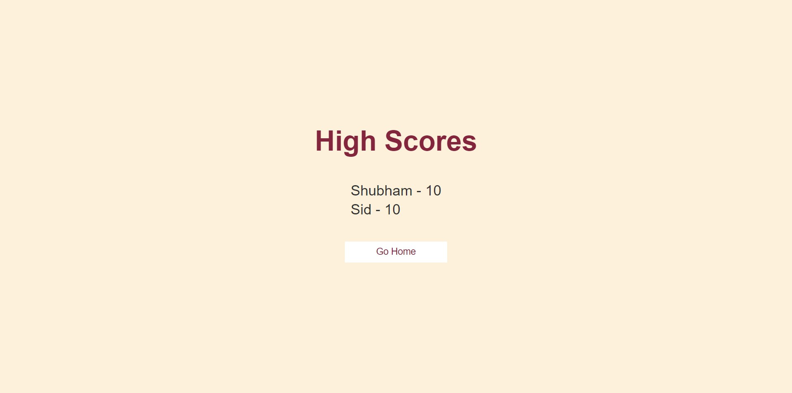
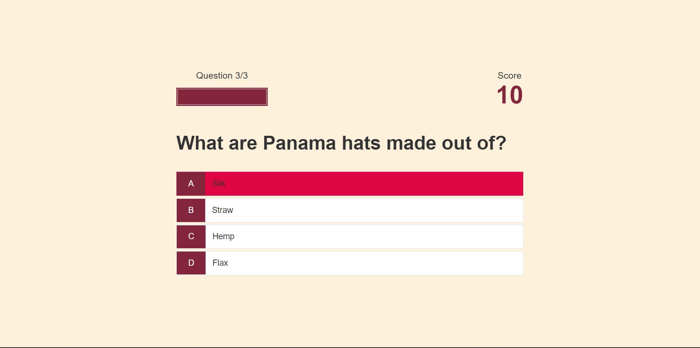

<!DOCTYPE html>
<html lang="en" dir="ltr">
  <head>
    <meta charset="utf-8">
   
<!--     <title>readme</title> -->
  </head>
  <body>
      <h1>Quiz App</h1>
      Build using HTML,CSS and Javascript this app generates a random question using API. The user has 3 questions and the final score is calculated and stored in local storage.
      <h3>Implemented Technologies</h3>
      <ul>
        <li>HTML</li>
        <li>CSS</li>
        <li>Javascript</li>
        <li>Trivia API - to generate questions</li>
      </ul>
      <h2>Screenshots</h2>
      

      
      
      
      
      
    

  </body>
</html>

